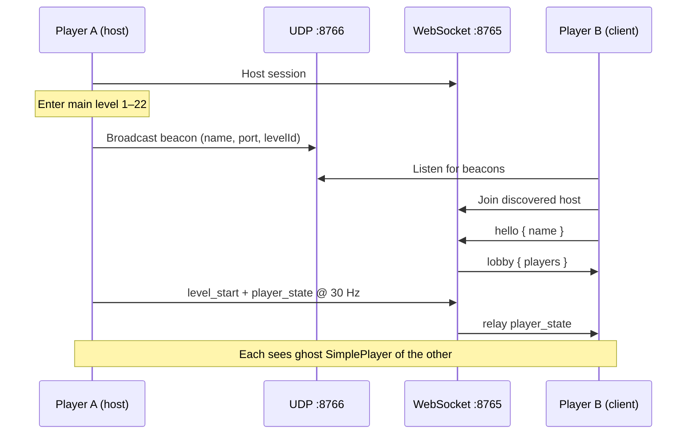

# Clam architecture

Technical overview of **Clam** (`paxcirlot.clam`) as of v1.1.3, plus unreleased work in the current source tree.

---

## What Clam is

Clam is a Geode mod that adds **LAN multiplayer presence** to Geometry Dash. Friends on the same Wi‑Fi can host a session, discover each other without typing IPs, and see each other's **ghost avatars** while playing the same main-campaign level.

It is **visual sync only**: each player runs their own physics. Ghosts do not collide, share triggers, or affect gameplay.

| Property | Value |
|----------|-------|
| Mod ID | `paxcirlot.clam` |
| GD version | 2.2081 (all platforms) |
| Geode version | 5.7.1 |
| WebSocket port (default) | 8765 |
| UDP discovery port (default) | 8766 |
| Repo | https://github.com/Bit-Byte5/Clam |

---

## Source layout

```
src/
  main.cpp              Mod load, MenuLayer button, LAN browser startup
  ui/
    ClamPopup.cpp       Host / Stop / nearby list / console UI
  net/
    NetSession.cpp      WebSocket host & client (websocketpp)
    LanDiscovery.cpp    UDP beacon browse + broadcast
    Protocol.hpp        JSON message builders + color packing
  game/
    PlayLayerHook.cpp   PlayLayer modify: sync tick + ghosts
    GameSync.cpp        Remote state, inbound queue, outbound tick
    GhostManager.cpp    SimplePlayer ghosts, interpolation
    LevelGate.hpp       Which levels support multiplayer
```

Dependencies (via CMake): **Geode SDK**, **websocketpp**, **standalone ASIO**.

---

## User flow



1. Open GD → main menu → **Clam** button.
2. **Host** starts a WebSocket server on `0.0.0.0` (configurable port).
3. Host **enters a main campaign level (1–22, classic mode)** — only then do they appear in the nearby list.
4. Others tap the host row in **Nearby players** to join (no IP entry).
5. Each player loads and plays the level locally; ghosts show remote position/icon.

LAN discovery runs from mod load until shutdown, not only while the popup is open.

---

## Threading model

Clam keeps network I/O off the main game thread. Cocos node updates stay on the main thread.

| Thread | Responsibility |
|--------|----------------|
| **Main (GD / cocos)** | UI, `PlayLayer::postUpdate`, ghost sprites, drain inbound queue, send local state ~30 Hz |
| **WebSocket** | One dedicated thread per session (`server->run()` or `client->run()`) |
| **LAN listen** | UDP recv, update discovered-game list |
| **LAN broadcast** | Periodic UDP send while host is in an eligible level |

### Main-thread game loop

`PlayLayerHook` runs after vanilla `postUpdate`:

1. `GameSync::drainIncoming()` — process queued WebSocket messages
2. `GameSync::getRemoteStates(levelId)` — snapshot peers in same level
3. `GhostManager::sync()` — create/update/interpolate ghost sprites
4. `GameSync::tickLocal()` — send local `player_state` every 50 ms

### Cross-thread boundary

**WebSocket → main:** handlers call `GameSync::queueIncoming()`, `queueRemovePeer()`, or `queueSessionStop()`. These append to mutex-protected vectors; the game thread drains them once per frame.

**Main → WebSocket:** `NetSession::sendGameMessage()` locks a per-connection `sendMutex` and calls websocketpp send. On the host, inbound game messages are **relayed on the WS thread** without touching the main thread.

**Why this matters:** lobby/disconnect handlers previously updated shared state directly from the WS thread and caused mutex deadlocks (fixed in v1.1.2). Disconnect and peer removal are now queued to main.

See also: `ClamPopup::onTick` (4 Hz) also calls `drainIncoming()` when the popup is open — redundant but harmless if already in a level.

---

## Networking

### LAN discovery (UDP)

Beacon JSON (untrusted advertisement only):

```json
{
  "type": "clam_beacon",
  "protocol": 1,
  "hostName": "PlayerName",
  "wsPort": 8765,
  "players": 2,
  "levelId": 5
}
```

- **Browse:** listen thread binds to discovery port, parses beacons, stores `DiscoveredGame` entries, prunes stale entries after 5 s.
- **Broadcast:** only when host role + `hostLevelId > 0`; sends every 1.5 s.
- **Linux/macOS:** broadcasts to subnet addresses via `getifaddrs` (not global `255.255.255.255` only). Android skips `getifaddrs`.
- **Nearby list filter:** only shows hosts with `levelId > 0`; hides self when hosting; hides currently joined host when client.

### WebSocket session (TCP)

Transport: plain `ws://` on LAN. No TLS, no room codes yet.

**Lobby messages** (handled on WS thread):

| Type | Direction | Purpose |
|------|-----------|---------|
| `hello` | client → host | Join with display name |
| `lobby` | host → all | Peer list `{ id, name }` |

**Game messages** (queued to main thread on receive; host relays to other clients):

| Type | Purpose |
|------|---------|
| `level_start` | Peer entered a level |
| `level_end` | Peer left a level |
| `player_state` | Position, rotation, dead, icon, scale, colors |

Host peer ID is always `0`. Remote peers get incrementing IDs from the host.

### Mod settings

| Setting | Default | Notes |
|---------|---------|-------|
| `ws-port` | 8765 | WebSocket listen/connect |
| `discovery-port` | 8766 | UDP beacon |
| `share-username` | true | Uses GD username; false shows `"Player"` |

---

## Protocol reference

Defined in `src/net/Protocol.hpp`.

### `player_state`

```json
{
  "type": "player_state",
  "peerId": 1,
  "levelId": 5,
  "x": 120.5,
  "y": 105.0,
  "rotation": 45.0,
  "dead": false,
  "iconId": 42,
  "scale": 1.0,
  "color1": 16711680,
  "color2": 255
}
```

- **Send rate:** ~30 Hz default (`sync-send-hz` setting, 15–60 Hz). Lite packets every tick; full icon/color/scale when changed or ~1 s.
- **Colors:** packed as 24-bit RGB integers (`0xRRGGBB`).
- **Interpolation:** timestamped snapshot buffer with configurable render delay (`interpolation-delay-ms`, default 35 ms) and up to 15% extrapolation.
- **Scale:** from `PlayerObject::getScale()` (mini ≈ 0.5).

### `level_start` / `level_end`

```json
{ "type": "level_start", "peerId": 1, "levelId": 5 }
{ "type": "level_end",   "peerId": 1, "levelId": 5 }
```

Sent when entering/leaving an eligible level. Remote ghosts are removed on `level_end` or disconnect.

---

## Game sync & ghosts

### Level eligibility (`LevelGate.hpp`)

Multiplayer activates only when **all** of:

- Active Clam session (host or client)
- Main campaign level (`GJLevelType::Main`)
- Level ID 1–22
- Not platformer mode

### `GameSync`

- Holds `RemotePeerState` per peer (position, rotation, dead, icon, scale, colors, level, last seen).
- Parses inbound JSON on main thread in `handleMessage` / `applyPlayerState`.
- Clears remotes on level exit or session stop.

### `GhostManager`

- Spawns `SimplePlayer` nodes on the play layer's object layer (non-colliding visuals).
- Hides ghost when remote player is dead.
- Removes stale ghosts when peer leaves level or disconnects.

**v1.1.3 (released):** direct position/rotation from network state each frame.

**Current source (unreleased):**

- Exponential smoothing (~14/s) toward target position/rotation
- Snap on large teleports (>120 px)
- Sync icon frame via `updatePlayerFrame`
- Sync scale and primary/secondary colors via `setColors`

---

## UI (`ClamPopup`)

- **Host / Stop** — start or tear down WebSocket session.
- **Nearby players** — scroll list of LAN hosts in levels; tap to join.
- **Console** — drains `NetSession` event log.
- Refreshes every 0.25 s while open.

Status strings reflect role: idle, hosting (waiting for level), live on LAN (level N), connected client.

---

## Build & release

```bash
export GEODE_SDK=/path/to/geode/sdk
geode build
# Output: build/paxcirlot.clam.geode
```

CI (`.github/workflows/`):

- **multi-platform.yml** — build on push
- **release.yml** — tag `v*` → combined cross-platform `.geode` on GitHub Releases

Distribution: GitHub Releases, Mocha Modding (https://saltmine.me). See [DEV-SHARING.md](DEV-SHARING.md).

---

## Known limitations

| Area | Limitation |
|------|------------|
| Security | Anyone on LAN can join; no room code or auth |
| Scope | Main 1–22 classic only |
| Gameplay | Visual sync only — no shared death, checkpoints, or triggers |
| Gamemode | Cube icon shown; ship/ufo/ball mode not synced |
| Glow | Glow colors not synced |
| Internet | LAN only; no relay or NAT traversal |
| Platform | Firewall must allow TCP 8765 and UDP 8766 on host |

---

## Version history (summary)

| Version | Highlights |
|---------|------------|
| 1.0.0 | Project setup |
| 1.0.1 | LAN discovery, WebSocket lobby, settings |
| 1.1.0 | Ghost avatars, position sync, tap-to-join, in-level LAN visibility |
| 1.1.1 | Linux subnet broadcast fix |
| 1.1.2 | Mutex deadlock fix, main-thread disconnect, persistent LAN browser |
| 1.1.3 | Fix host crash on client join (LAN broadcast restart) |

Full changelog: [../changelog.md](../changelog.md).

---

## Related docs

- [NEXT.md](NEXT.md) — roadmap (security, polish, future features)
- [DEV-SHARING.md](DEV-SHARING.md) — dev builds and tester install
- [../README.md](../README.md) — quick start
